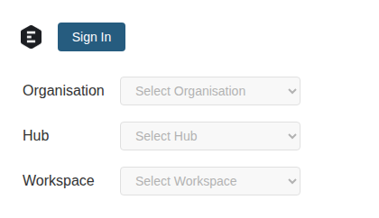
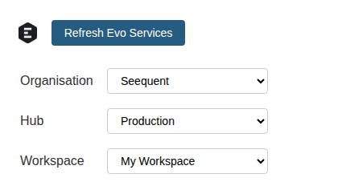
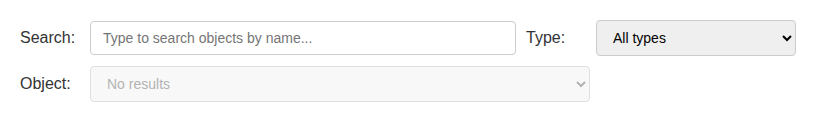
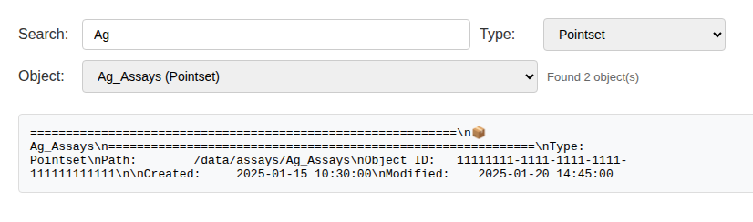

# evo-widgets

Modern Jupyter widgets for Seequent Evo using [anywidget](https://anywidget.dev/).

## Overview

`evo-widgets` provides interactive Jupyter notebook widgets for working with Seequent Evo services. These widgets enable authentication, organisation/hub/workspace selection, object search, and progress feedback—all with a modern, cross-platform implementation using anywidget.

## Installation

```bash
pip install evo-widgets
# or with uv
uv add evo-widgets
```

## Migration from evo.notebooks

This package replaces the widgets from `evo.notebooks`. The old widgets are deprecated and will continue to work but will show deprecation warnings.

### Quick Migration

| Old Import | New Import |
|------------|------------|
| `from evo.notebooks import FeedbackWidget` | `from evo.widgets import FeedbackWidget` |
| `from evo.notebooks import ServiceManagerWidget` | `from evo.widgets import ServiceManagerWidget` |
| `from evo.notebooks import ObjectSearchWidget` | `from evo.widgets import ObjectSearchWidget` |
| `from evo.notebooks import display_object_links` | `from evo.widgets import display_object_links` |

### Why Migrate?

- **anywidget**: Uses modern anywidget framework for better cross-environment support
- **Simpler architecture**: Each widget is self-contained with embedded JS/CSS
- **Better maintainability**: Cleaner separation between Python state and JavaScript rendering
- **Future-proof**: anywidget is the recommended approach for custom Jupyter widgets

## Widgets

### ServiceManagerWidget

The main widget for authentication and service configuration. Implements `IContext` for use with other Evo SDK components.

```python
from evo.widgets import ServiceManagerWidget

# Create and display the widget
widget = ServiceManagerWidget()
display(widget)

# After user signs in and selects workspace:
print(f"Organisation: {widget.org_id}")
print(f"Hub: {widget.hub}")
print(f"Workspace: {widget.workspace_id}")

# Use as a context for other SDK components
from evo.objects import ObjectsClient
objects_client = ObjectsClient(widget)
```




### FeedbackWidget

Progress indicator for long-running operations.

```python
from evo.widgets import FeedbackWidget

# Create widget
feedback = FeedbackWidget("Downloading")
display(feedback)

# Update progress (0.0 to 1.0)
feedback.progress = 0.5
feedback.message = "Processing data..."

# Complete
feedback.progress = 1.0
feedback.message = "Done!"
```


### ObjectSearchWidget

Search and browse geoscience objects in a workspace.

```python
from evo.widgets import ServiceManagerWidget, ObjectSearchWidget

# Set up service manager first
sm = ServiceManagerWidget()
display(sm)

# After signing in, create object search
search = ObjectSearchWidget(sm)
display(search)

# Get the selected object
if search.selected_object:
    print(f"Selected: {search.selected_object.name}")
    print(f"ID: {search.selected_object.id}")
```




### Individual Selector Widgets

For more control, use the individual selector widgets:

```python
from evo.widgets import (
    OrgSelectorWidget,
    HubSelectorWidget,
    WorkspaceSelectorWidget,
)

# Org selector
org_selector = OrgSelectorWidget()
display(org_selector)

# Hub selector (updates when org changes)
hub_selector = HubSelectorWidget()
display(hub_selector)

# Workspace selector (updates when hub changes)
ws_selector = WorkspaceSelectorWidget()
display(ws_selector)

# Wire them together
def on_org_change(change):
    hub_selector.set_org(change["new"])

def on_hub_change(change):
    ws_selector.set_hub(change["new"])

org_selector.observe(on_org_change, names=["value"])
hub_selector.observe(on_hub_change, names=["value"])
```


### display_object_links

Display clickable links to objects in Evo Central.

```python
from evo.widgets import display_object_links

# Display links for multiple objects
display_object_links(
    context=sm,  # ServiceManagerWidget or IContext
    objects=[obj1, obj2, obj3],
)
```

## Development

### Running Tests

```bash
# Install dependencies
uv sync --all-extras

# Install Playwright browsers
uv run playwright install chromium

# Run tests
uv run pytest

# Update visual regression baselines
uv run pytest tests/test_widget_screenshots.py --update-snapshots
```

### Project Structure

```
evo-widgets/
├── src/evo/widgets/
│   ├── __init__.py          # Public API
│   ├── _consts.py            # Constants and embedded assets
│   ├── _helpers.py           # Utility functions
│   ├── authorizer.py         # OAuth authorization helper
│   ├── env.py                # Environment configuration
│   ├── widgets.py            # Widget implementations
│   └── static/               # JavaScript and CSS files
│       ├── feedback.js
│       ├── feedback.css
│       ├── dropdown.js
│       ├── dropdown.css
│       ├── service_manager.js
│       ├── service_manager.css
│       ├── object_search.js
│       └── object_search.css
├── tests/
│   ├── test_widget_screenshots.py  # Visual regression tests
│   ├── baselines/                  # Screenshot baselines
│   └── conftest.py
└── pyproject.toml
```

## License

Copyright © 2025 Bentley Systems, Incorporated. Licensed under the Apache License, Version 2.0.
